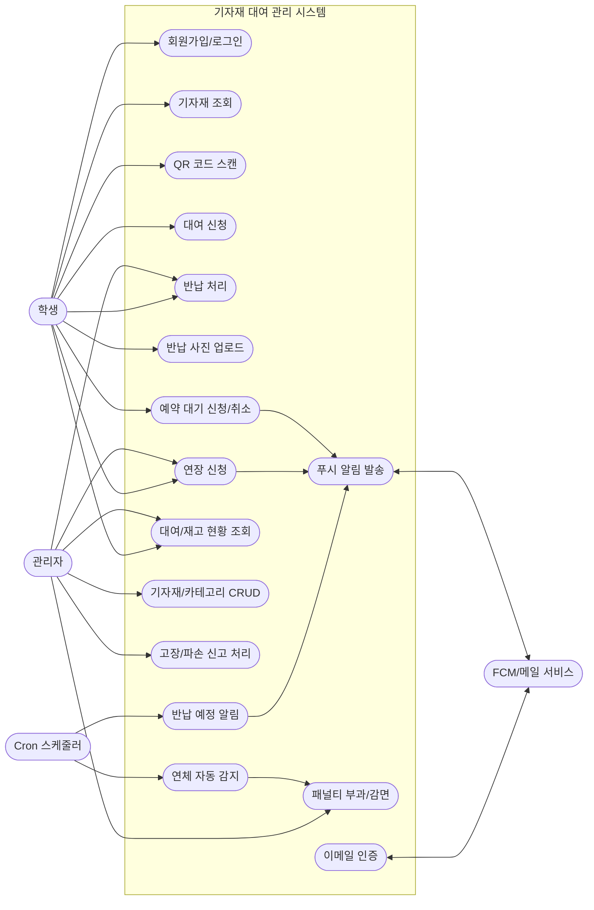
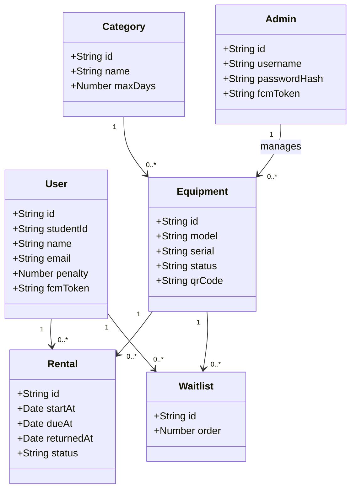
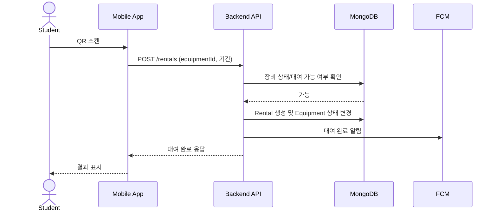
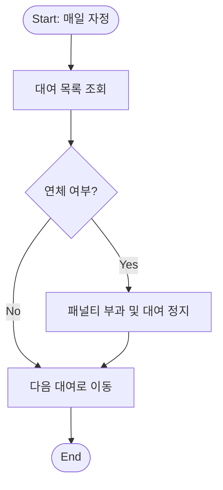

## 실험의 목적과 범위

### 목적
- QR 기반 기자재 대여/반납 자동화 시스템의 기능 완성도 검증
- 관리자/학생 흐름에서 발생하는 오류와 예외 처리 확인
- FCM 알림, 연체 감지, 예약 대기 등 핵심 자동화 기능의 유효성 확인

### 범위 (포함)
- 학생 앱: 회원가입/로그인, QR 스캔 대여, 반납(사진 첨부), 연장/예약 대기
- 관리자 앱: 기자재/카테고리 CRUD, 강제 반납, 패널티 관리
- 백엔드: JWT 인증, 대여/반납 상태 전이, Cron 기반 연체/알림 자동화
- 외부 연동: FCM 알림, 이메일 인증(SendGrid)

### 범위 (불포함)
- iOS 배포 및 실기기 테스트
- 대규모 동시 접속 부하 테스트
- 다국어 지원 및 접근성(Accessibility) 개선

---

## 분석 (기능의 목록 - 유스케이스 + 명세서)

### 유스케이스 다이어그램 (Mermaid)


### 기능 명세서 (요약)
| 구분 | 기능 | 입력 | 처리 | 출력 | 예외/제약 |
|---|---|---|---|---|---|
| 회원 | 회원가입/로그인 | 이메일/비밀번호/인증번호 | 이메일 인증, JWT 발급 | 토큰, 사용자 정보 | 패널티 누적 시 대여 제한 |
| 대여 | QR 기반 대여 | QR 코드 | 기자재 상태 확인, 대여 등록 | 대여 완료 상태 | 대여중/수리중이면 실패 |
| 반납 | 반납 처리 | 사진 첨부 | 상태 변경, 기록 저장 | 반납 완료 | 사진 미첨부 시 실패 |
| 연장 | 연장 신청 | 연장 기간 | 관리자 승인/거절 | 연장 결과 알림 | 연체 상태면 실패 |
| 예약 | 예약 대기 | 기자재 ID | 대기 리스트 등록 | 대기 순번 | 중복 신청 불가 |
| 관리자 | CRUD | 기자재/카테고리 정보 | 등록/수정/삭제 | 변경 결과 | 관리자 전용 |
| 알림 | FCM 발송 | 이벤트 트리거 | 토큰 조회 후 발송 | 푸시 알림 | 토큰 없으면 미발송 |
| 자동화 | 연체 감지 | 매일 자정 | 연체 계산/패널티 부과 | 상태 갱신 | 배치 실패 시 로그 |

---

## 설계 (클래스 다이어그램, 순서 다이어그램, 순서도, 슈더 프로그램 등)

### 1) 클래스 다이어그램 (Mermaid)


### 2) 순서 다이어그램 (대여 처리)


### 3) 순서도 (연체 감지 배치)


### 4) 슈더 프로그램 (Pseudo Code)
```text
function overdueJob()
  rentals = findActiveRentals()
  for each rental in rentals
    if today > rental.dueAt
      addPenalty(rental.userId)
      suspendUser(rental.userId)
      notifyUser(rental.userId, "연체 패널티 부과")
    end if
  end for
end function
```

---

## 구현 (구현 환경, 개발 언어, API 등)

### 구현 환경
- 프론트엔드: React Native 0.76, Expo SDK 54
- 백엔드: Node.js 18, Express
- DB: MongoDB Atlas (Mongoose ODM)
- 배포: Railway (서버), EAS Build (APK)
- 협업: GitHub, Figma

### 개발 언어
- JavaScript (Frontend/Backend 동일)

### 주요 API
| 목적 | Method | Endpoint | 설명 |
|---|---|---|---|
| 로그인 | POST | /auth/login | JWT 발급 |
| 회원가입 | POST | /auth/register | 학생 가입 |
| 기자재 조회 | GET | /equipment | 목록 조회 |
| QR 대여 | POST | /rentals | 대여 등록 |
| 반납 | POST | /rentals/return | 반납 처리 |
| 연장 | POST | /rentals/extend | 연장 신청 |
| 예약 | POST | /waitlists | 예약 대기 등록 |
| 관리자 CRUD | POST/PUT/DELETE | /admin/equipment | 기자재 관리 |

---

## 실험 (테스트 데이터와 결과)

### 테스트 데이터
- 사용자 계정: student01@test.com, admin01@test.com
- 기자재: 노트북 3대, 카메라 2대, 삼각대 2대
- 대여 기간: 1~7일 범위

### 테스트 결과
| 시나리오 | 기대 결과 | 실제 결과 |
|---|---|---|
| QR 스캔 후 대여 | 대여 성공 및 상태 변경 | 성공 |
| 반납 사진 미첨부 | 반납 실패 | 실패(정상) |
| 연체 감지 배치 | 패널티 부과 및 알림 | 성공 |
| 예약 대기 등록 | 순번 부여 | 성공 |
| 연장 신청 후 관리자 승인 | 대여 기간 연장 | 성공 |

---

## 결론 (작업 결과)

본 프로젝트는 QR 기반 대여/반납, 예약 대기, 연체 자동화, FCM 알림을 통합한 기자재 관리 시스템을 구현하였다.
학생/관리자 양측의 업무 흐름을 정형화하여 수기 업무를 감소시켰고, 배치 작업과 알림 연동을 통해 운영 효율을 높였다.
향후 과제로는 iOS 배포, 부하 테스트, 접근성 개선을 제안한다。
