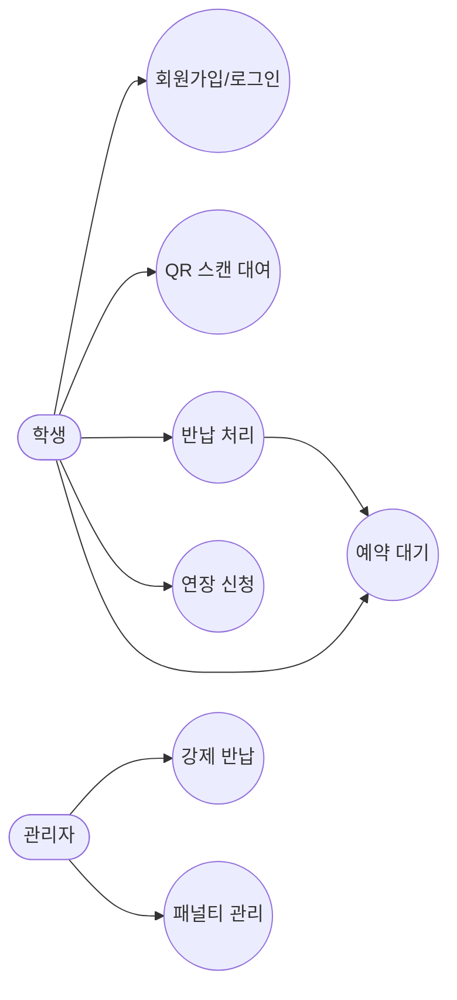
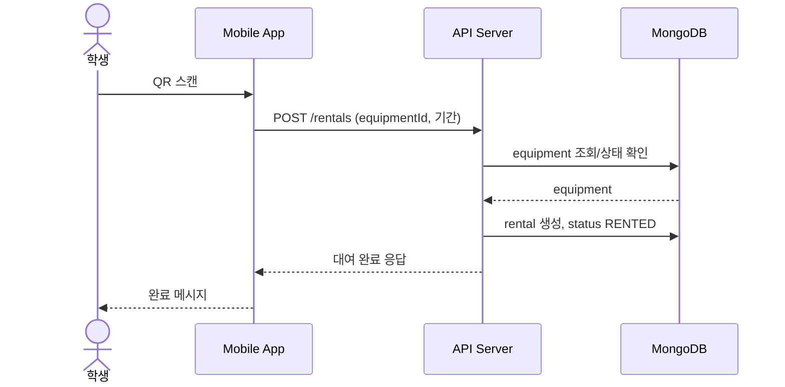
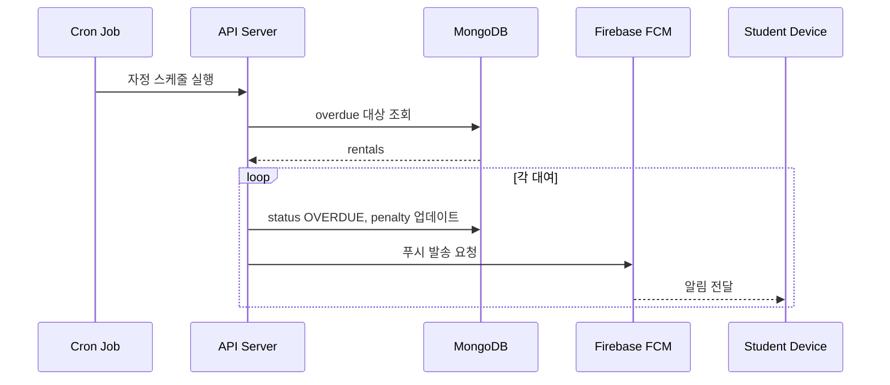
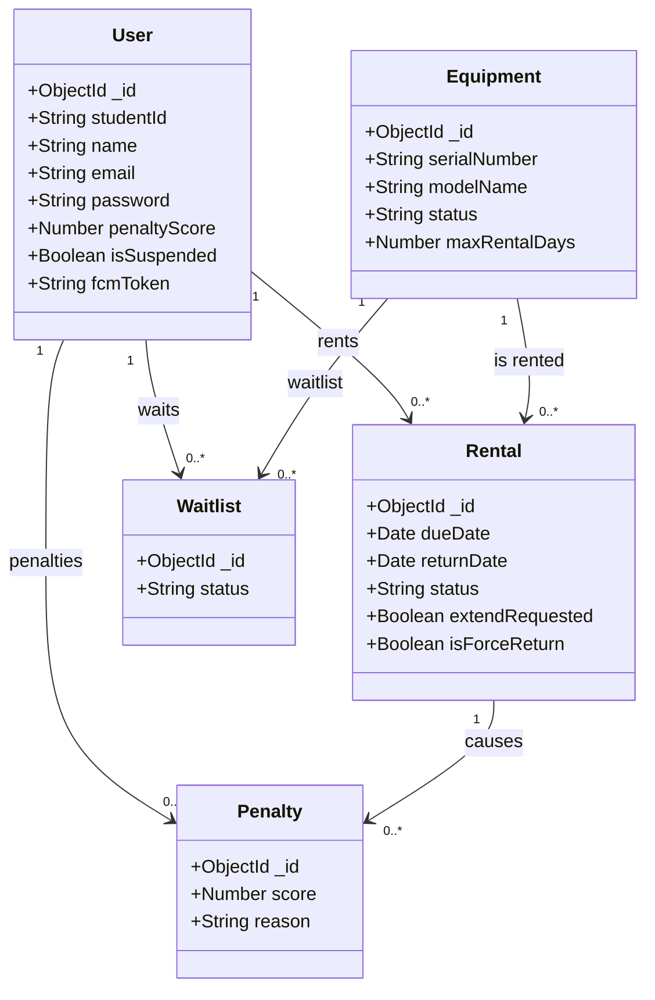

# 스마트 학과 기자재 대여 관리 앱 프로젝트 보고서

**과목**: 모바일 앱 개발  
**팀**: 2팀  
**팀원**: 김민석 · 윤동훈 · 안효진 · 정건우  
**제출일**: 2026년 5월 5일 

---

## 1. 실험의 목적과 범위

### 1.1 목적

학과 기자재 대여 관리 업무는 기존에 수기로 진행되어 관리 효율이 낮고, 연체 및 분실 사고가 빈번하게 발생하였다. 본 프로젝트는 QR 코드 기반의 기자재대여 시스템이다.  

- QR 코드를 활용한 기자재 대여 및 반납 프로세스 자동화
- 관리자 대시보드를 통한 실시간 재고 및 대여 현황 파악
- 연체 자동 감지 및 패널티 부과 시스템 구현
- FCM 푸시 알림을 통한 실시간 사용자 알림 서비스 제공
- 예약 대기 기능을 통한 기자재 활용도 향상
- 클라우드 배포를 통한 24시간 서비스 운영

### 1.2 포함 내용 (Scope In)

| 구분 | 내용 |
|------|------|
| 플랫폼 | Android 전용 모바일 앱 (React Native + Expo) |
| 인증 | 이메일 인증 기반 회원가입, JWT 로그인 |
| 대여 | QR 코드 스캔을 통한 대여, 반납, 연장 |
| 알림 | Firebase FCM 푸시 알림 (연체, 패널티, D-1/D-3) |
| 예약 | 예약 대기 신청/취소 및 반납 시 알림 |
| 관리 | 관리자 대시보드, 기자재 관리, 패널티 관리 |
| 배포 | Railway 클라우드 서버 배포 (24시간) |

### 1.3 불포함 내용 (Scope Out)

| 구분 | 내용 | 제외 사유 |
|------|------|----------|
| 플랫폼 | iOS 지원 | EAS Build 및 FCM iOS 설정 미완성 |
| 결제 | 연체료 결제 기능 | 과제 범위 초과 |
| 통계 | 고급 대여 통계 분석 | 추후 개선 사항 |
| 웹 | 웹 브라우저 버전 | 모바일 앱에 집중 |

---

## 2. 분석

### 2.1 요구사항 분석

#### 기능 요구사항

| ID | 요구사항 | 우선순위 | 상태 |
|----|---------|---------|------|
| FR-01 | 이메일 인증 기반 회원가입 (인증번호 TTL 5분) | 상 | 완료 |
| FR-02 | 학번 + 비밀번호 JWT 로그인 | 상 | 완료 |
| FR-03 | QR 코드 스캔을 통한 기자재 대여 | 상 | 완료 |
| FR-04 | 반납 시 사진 촬영 필수 | 상 | 완료 |
| FR-05 | 반납 예정일 연장 신청 및 관리자 승인/거절 | 중 | 완료 |
| FR-06 | 대여 중 기자재 예약 대기 신청/취소 | 중 | 완료 |
| FR-07 | 반납 시 예약 대기자 FCM 알림 | 중 | 완료 |
| FR-08 | 패널티 10점 이상 시 대여 자동 정지 | 상 | 완료 |
| FR-09 | 매일 자정 연체 자동 감지 및 패널티 부과 | 상 | 완료 |
| FR-10 | D-3, D-1 반납 예정 알림 자동 발송 | 상 | 완료 |
| FR-11 | 관리자 강제 반납 처리 (사유 입력 필수) | 중 | 완료 |
| FR-12 | 고장/파손 신고 및 관리자 처리 | 중 | 완료 |

#### 비기능 요구사항

| ID | 요구사항 | 분류 |
|----|---------|------|
| NFR-01 | 24시간 서버 운영 (Railway 클라우드) | 가용성 |
| NFR-02 | JWT 토큰 기반 API 보안 | 보안 |
| NFR-03 | 비밀번호 bcrypt 해시 암호화 | 보안 |
| NFR-04 | Firebase 서비스 계정 키 환경변수 관리 | 보안 |
| NFR-05 | Android APK 배포 (EAS Build) | 이식성 |

---

### 2.2 유스케이스 다이어그램




---

### 2.3 유스케이스 명세서

#### UC-05: QR 스캔 대여

| 항목 | 내용 |
|------|------|
| 유스케이스명 | QR 스캔 대여 |
| 액터 | 학생 |
| 사전 조건 | 로그인 상태, 패널티 정지 아님 |
| 사후 조건 | 기자재 상태 RENTED 변경, 대여 이력 생성 |
| 정상 흐름 | 1. QR 스캔 탭 접근 → 2. 카메라로 QR 스캔 → 3. 기자재 정보 확인 → 4. 대여 기간 입력 → 5. 대여 신청 → 6. 완료 |
| 예외 흐름 | RENTED 상태: 대여 불가 메시지 / 패널티 정지: 대여 불가 / 최대 기간 초과: 오류 메시지 |

#### UC-08: 예약 대기 신청

| 항목 | 내용 |
|------|------|
| 유스케이스명 | 예약 대기 신청 |
| 액터 | 학생 |
| 사전 조건 | 로그인 상태, 해당 기자재가 RENTED 상태 |
| 사후 조건 | Waitlist 컬렉션에 대기 정보 저장 |
| 정상 흐름 | 1. 기자재 상세 접근 → 2. 예약 대기 신청 버튼 → 3. 대기 순번 확인 → 4. 신청 완료 |
| 예외 흐름 | 이미 대기 중: 중복 신청 불가 / 패널티 정지: 신청 불가 |

#### UC-20: 강제 반납 처리

| 항목 | 내용 |
|------|------|
| 유스케이스명 | 강제 반납 처리 |
| 액터 | 관리자 |
| 사전 조건 | 관리자 로그인 상태, 대여 중인 기자재 존재 |
| 사후 조건 | 대여 RETURNED, 기자재 AVAILABLE, 학생 FCM 알림 발송 |
| 정상 흐름 | 1. 대여 현황 탭 → 2. 강제 반납 버튼 → 3. 사유 입력 모달 → 4. 확인 → 5. 처리 완료 → 6. FCM 발송 |
| 예외 흐름 | 사유 미입력: 입력 필수 안내 |

---

## 3. 설계

### 3.1 시스템 아키텍처

```
[Android APK (EAS Build)]
        ↓ HTTPS REST API
[Railway 서버 (Node.js + Express)]
        ↓                    ↓
[MongoDB Atlas]      [Firebase Admin SDK]
                             ↓
                     [Firebase FCM]
                             ↓
                     [학생 기기 알림]
```

**서버 URL**: https://equipment-rental-app-production.up.railway.app

---

### 3.2 시퀀스 다이어그램

#### QR 스캔 대여 흐름




#### FCM 알림 발송 흐름 (연체 자동 처리)




---

### 3.3 클래스 다이어그램



---

### 3.4 데이터베이스 설계

총 10개 컬렉션으로 구성하였다.

#### users (학생)

| 필드 | 타입 | 필수 | 설명 |
|------|------|------|------|
| _id | ObjectId | ✓ | 자동 생성 PK |
| studentId | String | ✓ | 학번 (unique) |
| name | String | ✓ | 이름 |
| email | String | ✓ | 이메일 (unique) |
| password | String | ✓ | bcrypt 해시 |
| penaltyScore | Number | | 패널티 점수 (기본 0) |
| isSuspended | Boolean | | 대여 정지 여부 |
| fcmToken | String | | FCM 토큰 |

#### equipment (기자재)

| 필드 | 타입 | 필수 | 설명 |
|------|------|------|------|
| _id | ObjectId | ✓ | 자동 생성 PK |
| category | ObjectId | ✓ | 카테고리 참조 |
| serialNumber | String | ✓ | 시리얼 번호 (unique) |
| modelName | String | ✓ | 모델명 |
| qrCodeUrl | String | | QR 코드 Base64 |
| status | String | | AVAILABLE/RENTED/REPAIRING/LOST |
| maxRentalDays | Number | | 최대 대여 기간 (기본 7일) |

#### rentals (대여)

| 필드 | 타입 | 필수 | 설명 |
|------|------|------|------|
| _id | ObjectId | ✓ | 자동 생성 PK |
| user | ObjectId | ✓ | 대여자 참조 |
| equipment | ObjectId | ✓ | 기자재 참조 |
| dueDate | Date | ✓ | 반납 예정일 |
| returnDate | Date | | 실제 반납일 |
| returnPhotoUrl | String | | 반납 사진 URL |
| status | String | | ACTIVE/RETURNED/OVERDUE |
| extendRequested | Boolean | | 연장 신청 여부 |
| isForceReturn | Boolean | | 강제 반납 여부 |

#### waitlists (예약 대기)

| 필드 | 타입 | 필수 | 설명 |
|------|------|------|------|
| _id | ObjectId | ✓ | 자동 생성 PK |
| equipment | ObjectId | ✓ | 기자재 참조 |
| user | ObjectId | ✓ | 신청자 참조 |
| status | String | | WAITING/NOTIFIED/EXPIRED |

---

### 3.5 API 설계

**Base URL**: `https://equipment-rental-app-production.up.railway.app/api`

| Method | Endpoint | 설명 | 인증 |
|--------|----------|------|------|
| POST | /auth/send-code | 이메일 인증번호 발송 | 불필요 |
| POST | /auth/register | 회원가입 | 불필요 |
| POST | /auth/login | 학생 로그인 | 불필요 |
| GET | /equipment | 기자재 목록 조회 | 필요 |
| POST | /rentals | 대여 신청 | 필요 |
| PUT | /rentals/:id/return | 반납 처리 | 필요 |
| PUT | /rentals/:id/extend | 연장 신청/승인 | 필요 |
| PUT | /rentals/:id/force-return | 강제 반납 | 관리자 |
| POST | /waitlist | 예약 대기 신청 | 필요 |
| DELETE | /waitlist/:id | 예약 대기 취소 | 필요 |
| POST | /admin/penalty | 패널티 부과 | 관리자 |
| GET | /api/health | 서버 상태 확인 | 불필요 |

---

### 3.6 알고리즘 설계 — 연체 자동 처리 (Cron)

```
[매일 자정 실행]
        ↓
ACTIVE 상태 대여 중 dueDate < 현재시각 조회
        ↓
  [대여 목록 있음?]
   Yes ↓      No → 종료
각 대여에 대해:
  1. status = OVERDUE 변경
  2. 연체 일수 계산 (days = floor((now - dueDate) / 86400000))
  3. Penalty 문서 생성 (score = days)
  4. User.penaltyScore += days
  5. penaltyScore >= 10 → isSuspended = true
  6. FCM 알림 발송 (연체 or 정지 알림)
        ↓
처리 완료 로그 출력
```

---

## 4. 구현

### 4.1 구현 환경

| 구분 | 도구 | 버전 |
|------|------|------|
| 개발 IDE | VS Code | 최신 |
| 버전 관리 | GitHub Desktop | 최신 |
| 서버 배포 | Railway | - |
| 앱 빌드 | Expo EAS Build | SDK 54 |
| DB 관리 | MongoDB Compass | 최신 |
| API 테스트 | Postman | 최신 |

### 4.2 기술 스택

#### 프론트엔드 (클라이언트)

| 기술 | 버전 | 용도 |
|------|------|------|
| React Native | 0.76 | 모바일 앱 프레임워크 |
| Expo | SDK 54 | 개발 도구 및 빌드 |
| Axios | - | HTTP API 통신 |
| AsyncStorage | - | 로컬 토큰 저장 |
| expo-camera | - | QR 코드 스캔 |
| expo-notifications | - | FCM 알림 수신 |
| expo-image-picker | - | 반납 사진 촬영 |
| react-navigation | - | 화면 전환 |

#### 백엔드 (서버)

| 기술 | 버전 | 용도 |
|------|------|------|
| Node.js | 18 | 서버 런타임 |
| Express | - | REST API 프레임워크 |
| Mongoose | - | MongoDB ODM |
| jsonwebtoken | - | JWT 인증 |
| bcryptjs | - | 비밀번호 암호화 |
| multer | - | 파일 업로드 |
| node-cron | - | 자동화 스케줄러 |
| qrcode | - | QR 코드 생성 |
| firebase-admin | - | FCM 서버 알림 |
| @sendgrid/mail | - | 이메일 발송 |

#### 외부 서비스

| 서비스 | 용도 | 요금 |
|--------|------|------|
| Railway | 백엔드 클라우드 배포 | 무료 |
| MongoDB Atlas | 클라우드 DB (M0) | 무료 |
| Firebase FCM | 푸시 알림 | 무료 |
| SendGrid | 이메일 인증 (100통/일) | 무료 |
| Expo EAS | APK 빌드 | 무료 |

### 4.3 주요 구현 코드

#### 연체 자동 처리 Cron 스케줄러

```javascript
cron.schedule('0 0 * * *', async () => {
  const now = new Date();
  const actives = await Rental.find({
    status: 'ACTIVE', dueDate: { $lt: now }
  }).populate('user').populate('equipment', 'modelName');

  for (const r of actives) {
    r.status = 'OVERDUE';
    await r.save();
    const days = Math.floor((now - r.dueDate) / 86400000);
    if (days >= 1) {
      await Penalty.create({
        user: r.user._id, rental: r._id,
        score: days, reason: `${days}일 연체 자동 부과`
      });
      const user = await User.findByIdAndUpdate(
        r.user._id, { $inc: { penaltyScore: days } }, { new: true }
      );
      if (user.penaltyScore >= 10 && !user.isSuspended) {
        user.isSuspended = true;
        await user.save();
        await sendPushToUser(user, '대여 정지', '패널티 누적으로 대여가 정지됐습니다.');
      } else {
        await sendPushToUser(user, '연체 알림',
          `${r.equipment?.modelName} 반납이 ${days}일 초과됐습니다.`);
      }
    }
  }
});
```

#### FCM 푸시 알림 발송

```javascript
async function sendNotification(fcmToken, title, body, data = {}) {
  if (!messaging || !fcmToken) return false;
  try {
    await messaging.send({
      token: fcmToken,
      notification: { title, body },
      data,
      android: { priority: 'high' },
    });
    console.log(`[FCM] 발송 완료: ${title}`);
    return true;
  } catch (e) {
    console.error('[FCM] 발송 실패:', e.message);
    return false;
  }
}
```

#### 예약 대기 신청 API

```javascript
waitlistRouter.post('/', protect, async (req, res) => {
  const { equipmentId } = req.body;
  if (req.user.isSuspended)
    return res.status(403).json({ message: '패널티로 인해 예약 대기가 불가합니다.' });

  const eq = await Equipment.findById(equipmentId);
  if (eq.status === 'AVAILABLE')
    return res.status(400).json({ message: '현재 대여 가능합니다. 바로 대여하세요.' });

  const existing = await Waitlist.findOne({
    equipment: equipmentId, user: req.user._id, status: 'WAITING'
  });
  if (existing)
    return res.status(400).json({ message: '이미 예약 대기 중입니다.' });

  const waitlist = await Waitlist.create({ equipment: equipmentId, user: req.user._id });
  const position = await Waitlist.countDocuments({
    equipment: equipmentId, status: 'WAITING',
    createdAt: { $lte: waitlist.createdAt }
  });
  res.status(201).json({ message: `예약 대기 등록. 순번: ${position}번`, position });
});
```

---

## 5. 실험 (테스트)

### 5.1 테스트 환경

| 항목 | 내용 |
|------|------|
| 테스트 기기 | BlueStacks (Android 에뮬레이터), 갤럭시 실물 폰 |
| 서버 | Railway 배포 서버 (https://equipment-rental-app-production.up.railway.app) |
| APK | EAS Build v4 (빌드 ID: affa6f07) |

### 5.2 테스트 결과 요약

| 분류 | 총 케이스 | 통과 | 실패 | 통과율 |
|------|---------|------|------|--------|
| 인증 | 5 | 5 | 0 | 100% |
| 대여/반납 | 8 | 8 | 0 | 100% |
| 예약 대기 | 4 | 4 | 0 | 100% |
| 관리자 | 6 | 4 | 2 | 67% |
| 알림 | 4 | 3 | 1 | 75% |
| 배포 | 3 | 2 | 1 | 67% |
| **합계** | **30** | **26** | **4** | **87%** |

### 5.3 주요 이슈 및 해결

| TC | 이슈 | 원인 | 해결 방법 |
|----|------|------|----------|
| TC-21 | Android 강제 반납 미작동 | Alert.prompt는 iOS 전용 API | Modal + TextInput 방식으로 교체 |
| TC-23 | 대시보드 실시간 미갱신 | useEffect 최초 1회만 실행 | useFocusEffect로 교체 |
| TC-26 | FCM JWT Signature 오류 | Firebase 서비스 계정 키 만료 | 새 키 재발급 후 환경변수 적용 |
| TC-30 | 이메일 발송 실패 | Railway SMTP 465포트 차단 | Gmail SMTP → SendGrid API 전환 |

---

## 6. 결론

### 6.1 작업 결과

본 프로젝트를 통해 React Native, Node.js, MongoDB를 활용한 모바일 앱 개발을 완성하였다. 총 4주에 걸쳐 설계부터 배포까지의 전 과정을 경험 

- QR 코드 기반 대여/반납 시스템 완성
- Firebase FCM 푸시 알림 실시간 발송 구현
- node-cron 스케줄러를 통한 연체 자동 처리
- 예약 대기 기능으로 기자재 활용도 향상
- Railway 클라우드를 통한 24시간 서비스 배포 완료
- 발생한 4개의 버그를 모두 수정하여 안정적인 동작 확인

### 6.2 아쉬운 점

- iOS 미지원으로 플랫폼 제한이 있음
- UI/UX 개선 여지가 있음

### 6.3 배운 점

- React Native 기반 크로스 플랫폼 앱 개발 역량 향상
- 클라우드 서버 배포 및 운영 경험 (Railway, MongoDB Atlas)
- Firebase Admin SDK를 활용한 서버 사이드 푸시 알림 구현
- 팀 협업 및 GitHub 기반 버전 관리 경험
- 실제 배포 환경에서 발생하는 이슈 해결 능력 (SMTP 포트 차단, JWT 오류 등)
